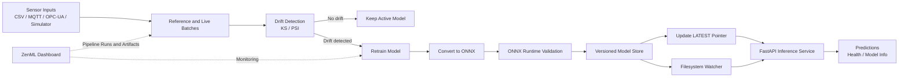

# EdgeMLOps Workflow

## Workflow Summary

1. Sensor data enters through a connector or simulator.
2. Reference and live batches are compared for distribution drift.
3. A no-drift result keeps the current model active.
4. Detected drift triggers local retraining.
5. The trained model is converted to ONNX.
6. ONNX Runtime validates the model before publication.
7. The validated model is stored as a versioned artifact.
8. The `LATEST` pointer identifies the active model.
9. FastAPI serves local predictions.
10. The filesystem watcher hot-reloads newly deployed models.
11. ZenML records pipeline runs and artifacts.
